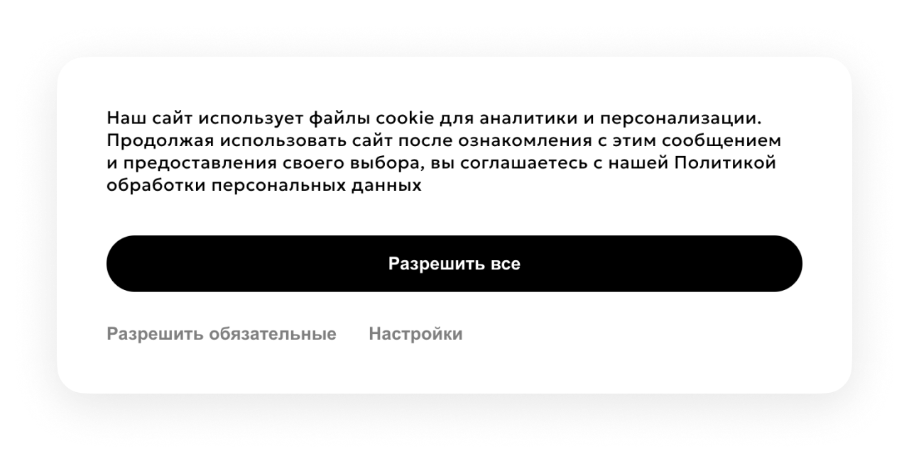
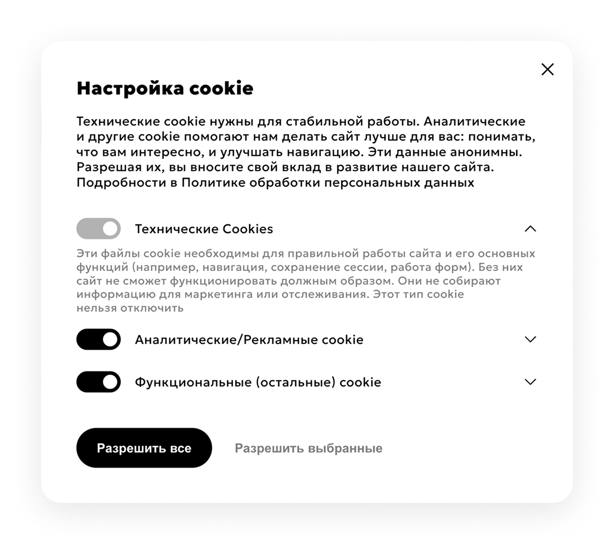

# El'Cookie

Легковесная библиотека без зависимостей для управления cookie-согласиями на сайте. Поддерживает категории cookies (обязательные, маркетинговые, функциональные), адаптивный баннер, модальное окно настроек и проверку разрешений

## Основное окно



## Окно настроек



## Ключевые возможности

- Поддержка категорий cookie (marketing, other и др.)
- Проверка согласия перед инициализацией скриптов
- Ленивая инициализация DOM-элементов и стилей
- Отсутствие внешних зависимостей
- Использование `localStorage` и/или cookie для хранения согласия
- Обход блокировщиков через динамические селекторы
- Адаптивный минималистичный интерфейс

## Принцип работы

El'Cookie использует механизм ленивой инициализации:

- DOM-элементы и стили создаются только в момент отображения баннера или окна настроек
- После закрытия все созданные элементы удаляются из DOM
- Стили автоматически очищаются при отсутствии активных компонентов

Это позволяет минимизировать влияние плагина на производительность страницы при первоначальной загрузке.

## Установка

Подключите скрипт перед закрывающим тегом `</body>`:

```html
<script src="el.cookie.js"></script>
```

Поменяйте основной цвет --cc-color-main под стиль проекта.

## Использование

### Описание параметров

- `COOKIE_CATEGORIES` — доступные категории согласия для аналитики/маркетинга и прочих сценариев
- `COOKIE_NAME` — имя cookie, где хранится выбранное пользователем согласие
- `COOKIE_EXPIRY_ALL_DAYS` — срок хранения полного согласия (в днях)
- `COOKIE_EXPIRY_REQUIRED_DAYS` — срок хранения только обязательных cookie (в днях)
- `RELOAD_ON_CONSENT_APPLY` — перезагружать ли страницу после применения настроек
- `API_OPEN_SETTINGS_CLASS` — CSS-класс элементов, по клику на которые открывается окно настроек
- `LINKS.policy` — ссылка на страницу политики обработки персональных данных

### Кастомизация дизайна

Основные настройки дизайна вынесены в переменные. В большинстве случаев достаточно заменить только цвет активных элементов в `--cc-color-main`.

### Проверка согласия (JavaScript)

Для выполнения кода только при наличии разрешения используйте метод PermissionChecker.check:

```js
PermissionChecker.check('marketing', () => {
    console.log('Маркетинговые cookie разрешены');
});

PermissionChecker.check('other', () => {
    console.log('Дополнительные cookie разрешены');
});
```

Код внутри callback-функции будет выполнен только при наличии согласия на соответствующую категорию.

### Проверка согласия (PHP)

Если необходимо управлять загрузкой скриптов на стороне сервера, можно использовать следующий пример:

```php
class CookieConsent
{
    private static array $permissions = [];

    private static function loadPermissions(): void
    {
        if (empty(self::$permissions)) {
            $consent = $_COOKIE['cookie_consent'] ?? '';
            self::$permissions = array_filter(explode(',', $consent));
        }
    }

    public static function hasConsent(string $category): bool
    {
        self::loadPermissions();
        return in_array($category, self::$permissions, true);
    }
}

// Usage
if (CookieConsent::hasConsent('marketing')) {
    echo '<script src="marketing.js"></script>';
}

if (CookieConsent::hasConsent('other')) {
    echo '<script src="additional-features.js"></script>';
}
```

### Открытие окна настроек

Открыть окно настроек можно программно:

`window.openCookieSettings();`

Или через добавление класса:

```html
<div class="open-cookie-settings">Настройки cookie</div>
```

## Лицензия

MIT License — свободное использование, модификация и распространение.

**Автор**

Andrey Shuin
El’System © 2025
